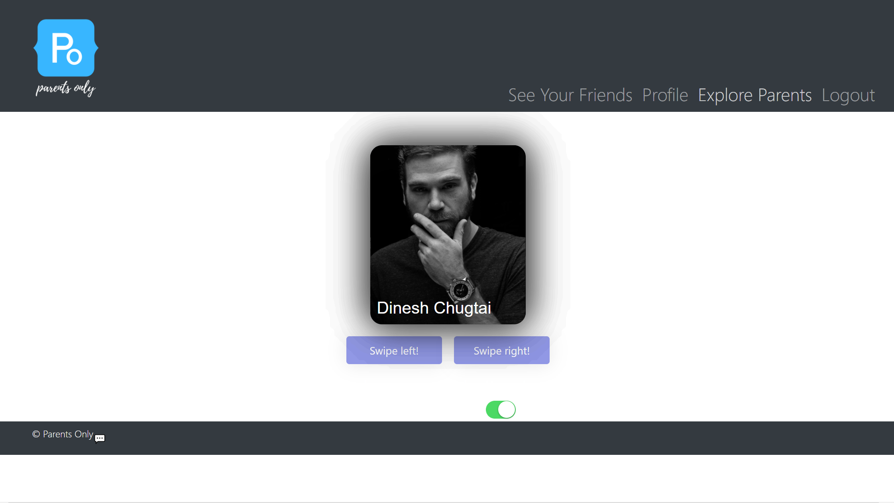

# Parents Only

## Summary
This app is designed to give parents the opportunity to meet other parents with similar lifestyle to connect and make friends. 

## Table of Contents
- [User Stories](#user-stories)
- [Acceptance Criteria](#acceptance-criteria)
- [Dependencies](#dependencies)
- [Screenshots](#screenshots)
- [Links](#links)
- [Contributors](#contributors)

## User Stories
AS A user/couple
I WANT to view and mingle with other users/couples
SO THAT me and my partner can meet people with kids like us to hang out with 

## Acceptance Criteria 
GIVEN a couples dating site  
WHEN I first load Parents Only  
THEN I am presented with a landing page with a navigation bar that has "Login" and "Sign up" links  
WHEN I choose to sign up  
THEN I am presented with three input fields to enter a username, email, and password  
WHEN I choose to log in  
THEN I am presented with two input fields for an email address and password  
WHEN I am logged in to the site  
THEN the navigation bar options change to "Home", "My Profile", "Explore Members", "See Your Matches", and "Logout"  
WHEN I scroll to the bottom of the page   
THEN I can see the footer where there are social media icons, “privacy-policy” page,  and “contact me” links  
WHEN I click on the “contact me” links     
THEN I am taken to a page with FAQ and presented  with a modal that accepts name, email, and message  
WHEN the "Home" navigation is toggled  
THEN I am presented with the home-page with the landing-page  
WHEN the "My Profile" navigation is toggled  
THEN I am taken to my profile page where i’m presented with my photo, my information, description with options to edit these text fields  
WHEN the "Explore Members" navigation is toggled  
THEN I am taken to a page that shows other members/couples in my pre-set distance range  
WHEN the members/couples are shown to me  
THEN i’m able to swipe left for “not interested” and right for “interested”  
WHEN i swipe right for “interested” on a couple that has also swiped right for me  
THEN they are added to my matches and I am able to message them  
WHEN the "See Your Matches" is toggled  
THEN the couples that I swiped right and that swiped right on me are shown all in one place  
WHEN I click "Logout"  
THEN I am logged out of the site and presented with the landing page  

## Dependencies
This project was bootstrapped with [Create React App](https://github.com/facebook/create-react-app)

To run this app, In the project directory run `npm install` to install node.js dependencies.

Then run `npm start` to run the server.
This will run the app in the development mode.
Open [http://localhost:3000](http://localhost:3000) to view it in the browser.

The page will reload if you make edits.  

## Screenshots

## Links
Github: https://github.com/parents-only/parents-only

Deployed to Heroku: https://arcane-reaches-47656.herokuapp.com/

## Contributors
* Alexandra Nance
* Sydney Porter
* Mera Youssef
* Max Plumer
* AJ Stribling
* Forrest Faulkner